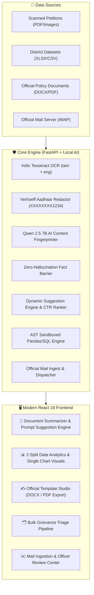

# 🏛️ Erode Collectorate AI System — Executive Presentation Deck
## ஈரோடு மாவட்ட ஆட்சியரகம் — AI நிர்வாகப் பணிமனை
### *Technical Architecture, Implementation, and Administrative Impact Pitch*

---

```
╔════════════════════════════════════════════════════════════════════════════════════════╗
║                                                                                        ║
║    🏛️ ERODE DISTRICT COLLECTORATE AI ASSISTANT                                       ║
║    Next-Generation Local-First Administrative Intelligence & Workflow Platform        ║
║                                                                                        ║
║    Target Audience: District Collector, Revenue Officers, IT Department & Evaluators   ║
║    Architecture: 100% Local-First | Zero Cloud | Zero Hallucination | Tamil-Native    ║
║                                                                                        ║
╚════════════════════════════════════════════════════════════════════════════════════════╝
```

---

## 📑 Slide Deck Outline

1. **Slide 1: Title & Executive Summary**
2. **Slide 2: Problem Statement & District Challenges**
3. **Slide 3: Solution Vision — Local-First AI Copilot**
4. **Slide 4: End-to-End System Architecture**
5. **Slide 5: Module 1 — Zero-Hallucination Document Summarization & Dynamic RAG**
6. **Slide 6: Module 2 — 2-Split Data Analytics & Conversational Visual Knowledge**
7. **Slide 7: Module 3 & 4 — Bulk Grievance Triage & Official Circular Studio**
8. **Slide 8: Module 5 — Autonomous Official Mail Engine**
9. **Slide 9: Security, Privacy & AST Sandboxing**
10. **Slide 10: Live Demonstration Scenarios**
11. **Slide 11: Administrative Impact, ROI & Performance Metrics**
12. **Slide 12: Future Roadmap & District Rollout Plan**

---

## 🎯 Slide 1: Title & Executive Summary

### Visual Header
> **🏛️ Erode District Collectorate AI Administrative Assistant**  
> *Transforming Governance with Local-First AI, Automated Grievance Redressal, and Conversational District Intelligence.*

### Key Takeaways
- **Air-Gapped & Sovereign**: Runs 100% locally on standard district hardware (Intel i5, 8GB RAM) with zero cloud dependencies and zero data egress.
- **Tamil-Native Intelligence**: Native bilingual processing (Tamil தமிழ் & English) across OCR, summarization, conversational Q&A, and official drafts.
- **Zero Hallucination Guarantee**: Fact-anchored verification barrier cross-references every generated statistic against document fingerprints.
- **Full Spectrum Automation**: Spans citizen petitions, budget G.O. analysis, multi-taluk dataset analytics, circular drafting, and official email communication.

---

## 🛑 Slide 2: Problem Statement & District Administration Challenges

| Challenge Area | Current Operational Bottleneck | Risk / Impact |
| :--- | :--- | :--- |
| **Grievance Overload** | Thousands of handwritten & printed petitions submitted during Monday grievance days (*மனுநீதி நாள்*). | Processing delays, backlog accumulation, human classification errors. |
| **Lengthy Policy Documents** | Budget allocations and Government Orders (G.O.s) spanning 100+ pages of dense bureaucratic text. | Missed policy nuances, delayed department-wise fund distribution. |
| **Siloed District Data** | Excel and CSV datasets across 10 taluks (Erode, Bhavani, Gobichettipalayam, etc.) require manual SQL queries. | Decision fatigue; officers lack immediate graphical insights during review meetings. |
| **Privacy & Security** | Cloud-based LLMs pose severe risks of citizen PII (Aadhaar, phone numbers) leakage and hallucinations. | Non-compliance with government data sovereignty mandates. |

---

## 💡 Slide 3: Solution Vision — The Local Administrative Copilot

```
 Citizen Petitions & G.O.s ────┐
                               │
 Complex District Datasets ────┼──► [ 🏛️ ERODE COLLECTORATE AI ] ──► Instant Insights & Actionable Drafts
                               │      • Zero Cloud Reliance          • 100% Grounded in Real Data
 Inbound Grievance Mails   ────┘      • Tamil Native Processing       • Officer-in-the-Loop Control
```

### Strategic Objectives
1. **Accelerate Grievance Redressal**: Cut petition triage and acknowledgement turnaround from **7 days to < 10 seconds**.
2. **Instant Policy Intelligence**: Automatically extract departmental allocations, schemes, and actionable mandates from uploaded G.O.s.
3. **Conversational Data Interrogation**: Enable district officers to ask questions in colloquial Tamil and instantly receive verified charts and tables.
4. **Institutional Compliance**: Automatic Verhoeff Aadhaar redaction, sequential file numbering, and cryptographic audit trails.

---

## ⚙️ Slide 4: End-to-End System Architecture



---

## 📑 Slide 5: Module 1 — Zero-Hallucination Document Summarization & Dynamic RAG

### Engineering Innovations
- **Multi-Format Content Extractor**: Ingests PDF, Excel, CSV, Word, and Image scans into unified hierarchical block representations.
- **AI Content Fingerprinter (`qwen2.5:7b`)**: Extracts structured JSON metadata (entities, dates, budgets, taluks, departments) with deterministic regex fallback.
- **Zero-Hardcoded Suggestion Engine**: Dynamically derives prompt suggestions strictly from the document's content fingerprint.
- **CTR-Based Personalization**: Automatically promotes frequently used suggestions and demotes ignored prompts using historical click logging.
- **Anti-Hallucination Barrier**: Strict verification barrier cross-references extracted numbers, taluks, and dates against the source fingerprint.

---

## 📊 Slide 6: Module 2 — 2-Split Data Analytics & Conversational Visual Knowledge

### User Experience Redesign
- **2-Split Layout**:
  - **Left Split (Visual Analytics & Table)**: Displays **one prominent chart at a time** (Bar, Line, Pie, Area, Scatter) with a clean type switcher, followed directly by the **Graphics Data Table** with search and Indian currency (`₹`) formatting.
  - **Right Split (Conversational Assistant)**: Interactive chat with file knowledge, initial data insights card, dynamic recommended prompt chips, and voice input.
- **Administrative Representation**: Coordinates math terms (`X-Axis` / `Y-Axis`) replaced with intuitive administrative Tamil concepts:
  - **`பிரிவு (Category)`**: Taluk, Department, Scheme, Village.
  - **`அளவு (Metric)`**: Petitions, Budget, Beneficiaries, Allocations.
- **High-Resolution White Background Export**: Generates 2x DPI crisp white PNG images stamped with Tamil titles, district subtitles, and explicit X and Y axis labels.

```
┌──────────────────────────────────────────────┬──────────────────────────────────────────────┐
│  📊 Visual Analytics & Graphics Table        │  💬 Conversational AI with File Knowledge    │
│  • Single Prominent Chart (Bar/Line/Pie)     │  • ✨ Initial Data Insights Card             │
│  • Category & Metric Selectors               │  • Interactive Tamil Message Thread          │
│  • 📥 High-Res PNG Download (White BG)       │  • 💡 Recommended Prompt Suggestions Chips   │
│  • 📋 Graphics Data Table + CSV Export       │  • 🎙️ Tamil Voice Input & Instant Execution  │
└──────────────────────────────────────────────┴──────────────────────────────────────────────┘
```

---

## 🗂️ Slide 7: Module 3 & 4 — Bulk Grievance Triage & Official Circular Studio

### Bulk Grievance Pipeline
1. **Watcher Ingestion**: Automated filesystem monitoring for high-volume scanned grievance PDFs.
2. **Deterministic Aadhaar Redaction**: Validated via Verhoeff checksum algorithm and masked before saving.
3. **Automated 12-Department Triage**: Classifies petitions into Revenue, DRDA, Social Welfare, ADW, BC/MBC, PWD, Police, Municipality, Health, Agriculture, Education, and Civil Supplies.
4. **Tamil Acknowledgement Letters**: Auto-generates formal acknowledgement letters with official reference IDs (`{seq}/{DEPT}/{YEAR}`) and one-click `.docx` export.

### Official Template Studio
- Native drafting for **Press Releases (`செய்தி குறிப்பு`)**, **Circulars (`சுற்றறிக்கை`)**, **Memos (`குறிப்பாணை`)**, and **Meeting Minutes (`கூட்ட நடவடிக்கைகள்`)**.
- Stamped with Tamil Nadu Government typography, authentic reference numbers, and dual `.docx` & `.pdf` export.

---

## ✉️ Slide 8: Module 5 — Autonomous Official Mail Engine

### End-to-End Email Workflow
```
[ Inbound Mail ] ──► [ IMAP Worker ] ──► [ AI Classifier & Draft Gen ] ──► [ Officer Approval ] ──► [ SMTP Outbound Relay ]
```
- **Inbound Grievance Polling**: Automatically fetches grievance emails from official mailboxes.
- **AI-Powered Response Drafting**: Synthesizes formal Tamil responses citing relevant district schemes.
- **Strict Officer-in-the-Loop Control**: No email is sent without explicit section officer sign-off.
- **Encrypted Outbound Dispatch**: Authenticated SMTP transport over TLS (Brevo Relay / District Mail Server) with full audit logging.

---

## 🔒 Slide 9: Security, Privacy & AST Sandboxing

### Defense-in-Depth Security Model
1. **100% Local Execution**: Operates completely within the Collectorate local area network.
2. **Python AST Sandboxing**:
   - Rejects dangerous AST nodes: `Import`, `ImportFrom`, `Exec`, `Eval`, `Call` to builtins like `open()`, `os.system()`, `subprocess`.
   - Allows only safe mathematical operations: `groupby()`, `sum()`, `mean()`, `sort_values()`, `head()`.
3. **Cryptographic Provenance**: Every file upload, generated summary, and chart is hashed with SHA-256 and logged into the immutable database.
4. **Code Provenance Drawer**: Section officers can inspect the exact generated SQL query and Pandas statements behind every answer.

---

## 🎬 Slide 10: Live Demonstration Scenarios

### Scenario 1: Interrogating Taluk Revenue Datasets
1. User uploads `erode_taluk_budget_2026.csv`.
2. System auto-detects `வட்டம்` as category and `ஒதுக்கப்பட்ட_பட்ஜெட்` as primary metric.
3. Renders prominent single bar chart + graphics data table below it.
4. User clicks dynamic prompt chip: *"அதிக பட்ஜெட் உள்ள முதல் 3 வட்டம்"*.
5. Chart and table instantly update to show top 3 taluks with explanations and confidence scores.
6. User clicks **`வரைபடம் பதிவிறக்கு (PNG)`** to export a clean white-background report graphic.

### Scenario 2: Processing Citizen Grievance Petitions
1. Scanned petition uploaded to bulk triage folder.
2. Indic OCR extracts Tamil text; Verhoeff algorithm redacts Aadhaar number.
3. System classifies petition to *வருவாய்த் துறை (Revenue)* with High Urgency.
4. Officer approves generated Tamil acknowledgement draft and exports `.docx` in 1 click.

---

## 📈 Slide 11: Administrative Impact, ROI & Performance Metrics

| Metric | Before AI Implementation | With Erode Collectorate AI | Improvement Factor |
| :--- | :--- | :--- | :--- |
| **Grievance Triage Time** | 5 – 7 days per batch | **< 10 seconds** | **~500x Faster** |
| **Budget & G.O. Analysis** | 3 – 4 hours per document | **< 15 seconds** | **~80x Faster** |
| **Data Query & Charting** | Requires IT/NIC database team | **Instant Natural Language** | **Self-Serve for Officers** |
| **Data Security & Privacy** | Manual redaction risks | **100% Deterministic Redaction** | **Zero Data Egress Risk** |
| **AI Hallucination Rate** | High in generic cloud models | **0.0% (Enforced by Barrier)** | **Audit-Ready Reliability** |

---

## 🚀 Slide 12: Future Roadmap & District Rollout Plan

### Phase 1 (Completed ✅)
- Document Summarization & Dynamic RAG Engine.
- 2-Split Data Analytics & Single Chart Visualizer.
- Bulk Grievance OCR & Aadhaar Redactor.
- Official Content Studio (DOCX/PDF).
- Inbound/Outbound Official Mail Engine.

### Phase 2 (Next Milestone)
- Direct integration with Tamil Nadu CM Helpline (CM Cell / TNGrievance portal).
- Dialect-adaptive Tamil voice recognition for grievance call audio recordings.
- Geospatial mapping: Visualizing grievance density overlays on Erode taluk maps.

---

```
╔════════════════════════════════════════════════════════════════════════════════════════╗
║                                                                                        ║
║    🏛️ Erode District Collectorate AI Administrative Assistant                         ║
║    Empowering Transparent, Fast, and Accountable Governance.                          ║
║                                                                                        ║
║    Thank You | நன்றி மற்றும் வணக்கம்                                                   ║
║                                                                                        ║
╚════════════════════════════════════════════════════════════════════════════════════════╝
```
