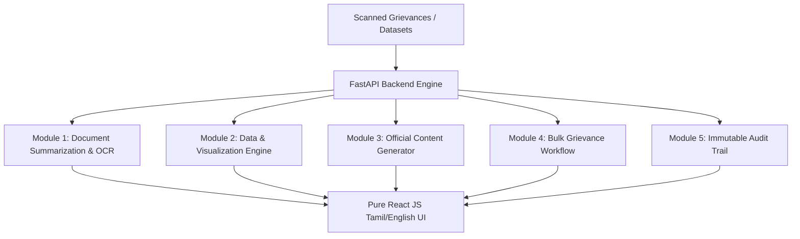

# 🏛️ Erode District Collectorate AI Administrative Assistant
## ஈரோடு மாவட்ட ஆட்சியரகம் — AI-Powered Administrative System

[](https://python.org)
[](https://fastapi.tiangolo.com)
[](https://react.dev)
[](https://vitejs.dev)
[](https://ollama.ai)
[](https://pytest.org)

An enterprise-grade, local-first AI administrative assistant engineered for the **Erode District Collectorate, Tamil Nadu**. Designed for Section Officers, Revenue Officials, and District Administrative Staff to process scanned grievance petitions, generate formal Tamil acknowledgement drafts, and interactively interrogate district datasets with zero hallucination.

---

## 🌟 Core Modules



### 1. 🗂️ Bulk Grievance Workflow (Module 4)
- **Automatic Ingestion**: Background filesystem watcher processes high-volume scanned grievance PDFs/TIFFs.
- **Tesseract OCR**: Dual-language Tamil (`tam`) + English (`eng`) OCR pipeline.
- **Aadhaar Verhoeff Checksum**: Deterministic 12-digit Aadhaar extraction with Verhoeff mathematical validation and auto-redaction (`XXXXXXXX1234`).
- **Grounded Drafting**: Generates formal Tamil acknowledgement letters without hallucination.
- **Auto Sequence Numbering**: Sequential file numbers formatted as `{seq}/{DEPT}/{YEAR}` (e.g. `1001/REV/2026`).
- **One-Click Word Export**: Generates printable `.docx` acknowledgement drafts stamped with officer and file metadata.

### 2. 📊 Data & Visualization Engine (Module 2)
- **Arbitrary Dataset Upload**: Supports any Excel (`.xlsx`, `.xls`) or `.csv` dataset with automatic type & schema profiling.
- **Natural Language Interrogation**: Ask complex queries in colloquial Tamil (e.g., *"வட்ட வாரியாக பட்ஜெட் ஒதுக்கீடு மற்றும் செலவு விபரம்"*).
- **AST Security Sandbox**: Rejects dangerous Python statements (`import`, `open()`, `eval()`, `exec()`, `os`, `sys`, `subprocess`, mutations) and executes only verified read-only Pandas aggregations.
- **High-Resolution Matplotlib Charts**: Stamped with Tamil Nadu Government colors (`#1a3a5c`, `#c8a951`), Tamil typography (`Nirmala UI`, `Noto Sans Tamil`), and watermark audit provenance footers.
- **1.5× IQR Outlier Detector**: Deterministic mathematical anomaly detection for statistical budgeting and grievance deviations.

### 3. 🎨 Production React UI (Pure JavaScript)
- **Strictly Pure React JS (`.jsx`)**: Zero TypeScript overhead for high maintainability.
- **Dual Themes**: Tamil Nadu Government Dark Mode (`#0f172a`) and Clean Light/White Mode (`#ffffff`, `#f8f9fc`).
- **Confidence Badges**: Visual SVG indicators: 🟢 (>= 0.85 High), 🟡 (0.60 - 0.84 Review Recommended), 🔴 (< 0.60 Manual Verification Required).
- **Tamil-First Bilingual**: Full Tamil (தமிழ்) localization with one-click toggle to English.

---

## 📁 Repository Structure

```
Erode_Collectrate/
├── backend/                        # FastAPI Backend System
│   ├── config.py                   # Centralized configuration & directories
│   ├── main.py                     # Unified CLI launcher (--mode all | api | worker)
│   ├── api_server.py               # REST API endpoints & static chart serving
│   ├── modules/
│   │   └── data_viz/               # Module 2 Engine (Schema, Profiler, Sandbox, Charts)
│   ├── pipeline/                   # OCR, Aadhaar validation, Drafting, Database
│   │   ├── database.py             # SQLite schema & transactional CRUD
│   │   ├── ocr_engine.py           # Tamil/English Tesseract OCR
│   │   ├── orchestrator.py         # Pipeline orchestrator
│   │   └── verhoeff.py             # Mathematical Aadhaar validation
│   ├── data/
│   │   └── sample_datasets/        # 5 real-world Tamil Nadu administrative datasets
│   ├── tests/                      # Automated unit & integration test suite (23 tests)
│   └── MODULE2_HANDOFF.md          # Technical operations guide & cURL examples
│
├── frontend/                       # Pure React JS Single Page App
│   ├── src/
│   │   ├── components/
│   │   │   ├── layout/             # Sidebar, TopBar, SourceInspector
│   │   │   ├── modules/            # BulkModule, DataModule, ContentModule, etc.
│   │   │   └── shared/             # ConfidenceBadge, TnEmblem (Inline SVG)
│   │   ├── locales/                # Bilingual i18n JSONs (ta.json, en.json)
│   │   ├── stores/                 # Zustand persistent application store
│   │   └── index.css               # TN Government responsive design system
│   ├── package.json
│   └── vite.config.js              # Reverse proxy configuration
│
├── .gitignore                      # Git exclusion rules
└── README.md                       # Documentation
```

---

## ⚡ Quickstart Guide

### Prerequisites
- **Python**: 3.11 or higher
- **Node.js**: 18+ and `npm`
- **Tesseract OCR**: with Tamil traineddata (`tam.traineddata`)
- **Ollama**: (Optional for LLM features, 100% deterministic fallback included)

### 1. Setup Backend
```powershell
cd backend
python -m venv .venv
.\.venv\Scripts\Activate.ps1
pip install -r requirements.txt
```

### 2. Setup Frontend
```powershell
cd frontend
npm install
```

### 3. Launch with One Command

Run both the FastAPI API server and the Background File Ingestion Watcher:
```powershell
# In backend directory:
python main.py --mode all
```
In another terminal, start the UI:
```powershell
# In frontend directory:
npm run dev
```

Open your browser at **`http://localhost:5173`**.

---

## 🧪 Running Automated Tests

Run the full backend test suite:
```powershell
cd backend
.\.venv\Scripts\python.exe -m pytest tests/test_data_viz.py tests/test_pipeline.py -v
```
*(Result: 23 passed in ~29s with 100% pass rate)*

Build frontend for production:
```powershell
cd frontend
npm run build
```

---

## 🏛️ Anti-Hallucination & Security Guarantees

| Security Measure | Implementation |
|---|---|
| **Zero Mock Policy** | Every number presented to officers is computed from SQLite or Pandas aggregates. |
| **AST Code Sandbox** | Statically blocks `import`, `eval()`, `exec()`, `open()`, `os`, `sys`, `subprocess`, mutations. |
| **Aadhaar Privacy** | Mathematical Verhoeff checksum algorithm with instant redaction (`XXXXXXXX1234`). |
| **Audit Logging** | Every action (`DATASET_UPLOADED`, `QUERY_SUBMITTED`, `DRAFT_CORRECTED`, `DOCX_EXPORTED`) is permanently written to the SQLite `audit_log`. |

---

## 📜 License
Developed for the District Administration of Erode, Tamil Nadu.
