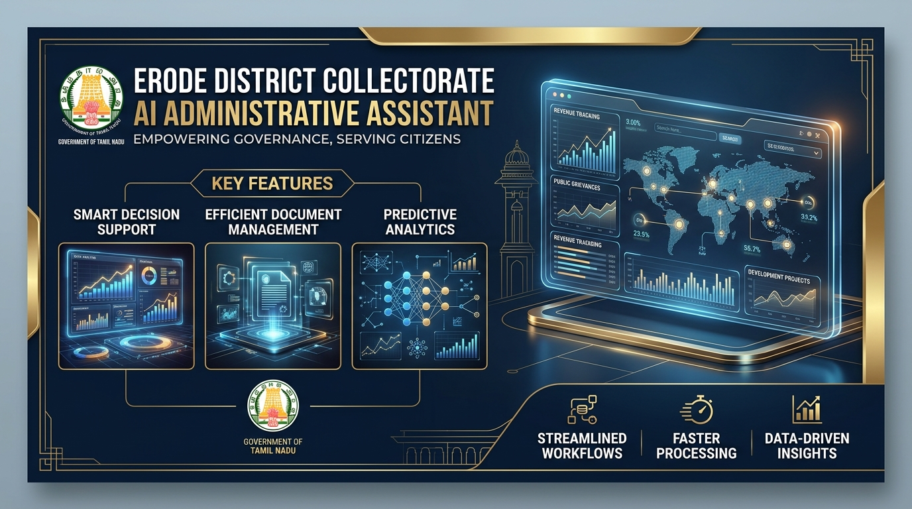
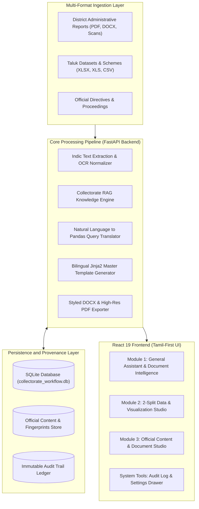

# 🏛️ Erode District Collectorate AI Administrative Assistant
## ஈரோடு மாவட்ட ஆட்சியரகம் — AI நிர்வாகப் பணிமனை

<div align="center">



[](https://opensource.org/licenses/Apache-2.0)
[](https://python.org)
[](https://fastapi.tiangolo.com)
[](https://react.dev)
[](https://vitejs.dev)
[](https://ollama.ai)
[](https://pytest.org)

---

### 🌟 Enterprise Showcase: Sovereign Public Sector & Industrial AI Architecture
> **Demonstrating how sovereign government administrations and global industrial enterprises can harness autonomous, local-first AI in mission-critical daily workflows — ensuring complete data sovereignty, zero cloud leakages, and deterministic precision.**

</div>

---

## 📋 Table of Contents
- [Executive Overview](#-executive-overview)
- [System Architecture](#%EF%B8%8F-system-architecture)
- [Core Active Functional Modules](#-core-active-functional-modules)
  - [Module 1: General Assistant & Document Intelligence](#-module-1-general-assistant--document-intelligence)
  - [Module 2: Data & Visualization Studio (2-Split Workspace)](#-module-2-data--visualization-studio-2-split-workspace)
  - [Module 3: Official Content & Document Studio (Bilingual)](#-module-3-official-content--document-studio-bilingual)
  - [System Tools: Audit Log & Settings](#-system-tools-audit-log--settings)
- [Security & Anti-Hallucination Guardrails](#-security--anti-hallucination-guardrails)
- [Tech Stack](#%EF%B8%8F-tech-stack)
- [Getting Started](#-getting-started)
  - [System Prerequisites](#system-prerequisites)
  - [Backend Setup](#backend-setup)
  - [Frontend Setup](#frontend-setup)
  - [Environment Configuration](#environment-configuration)
- [API Reference & Code Usage](#-api-reference--code-usage)
- [Project Directory Structure](#-project-directory-structure)
- [License](#-license)

---

## 🏛️ Executive Overview

The **Erode District Collectorate AI System** is an enterprise-grade, local-first artificial intelligence platform engineered specifically for the **District Administration of Erode, Tamil Nadu, India**.

Traditional cloud-dependent AI tools pose data-privacy risks for sovereign government administrations and fail on non-English administrative registers. This platform solves both challenges by combining:
1. **Local-First AI Models (Qwen 2.5 7B Instruct via Ollama & Collectorate RAG)** running on-premise without external cloud API reliance.
2. **Anti-Hallucination Grounding** that cross-examines AI responses against source page text, dataset tables, and official administrative SOPs before rendering.
3. **Pure Tamil-First Bilingual Intelligence (தமிழ் & English)** conforming strictly to Tamil Nadu Government DIPR standards (Press Releases, Collectorate Circulars, Office Memorandums, and Review Meeting Proceedings).
4. **Interactive 2-Split Data Workspace** enabling civil officers to query district CSV/Excel datasets using natural language queries with real-time interactive charts and tables.

---

## 🏗️ System Architecture



---

## ⚡ Core Active Functional Modules

### 💬 Module 1: General Assistant & Document Intelligence
* **Conversational Administrative Assistant:** Responds to administrative queries regarding Patta transfer, Old Age Pensions, Land Survey, Certificates, and PWD Grievances based on the Erode Collectorate Knowledge Base.
* **Universal Document QA:** Attach any file (`.pdf`, `.docx`, `.xlsx`, `.csv`, `.txt`, `.png`, `.jpg`) for instant AI summarization, key points extraction, deadlines, action items, and custom QA.
* **Auto-Generated Suggestion Chips:** Instant one-click prompt suggestions (*"What is this document about?"*, *"What are the key points?"*, *"Important dates & deadlines"*, *"Required actions"*).
* **Voice Input & Text-to-Speech:** Integrated Web Speech API supporting Tamil (`ta-IN`) and English (`en-IN`) voice typing and voice reading.

---

### 📊 Module 2: Data & Visualization Studio (2-Split Workspace)
* **Two-Column Analytical Grid:**
  - *Left Column:* High-resolution interactive charts (Bar, Line, Area, Pie, Donut, Scatter Plot) with real-time dataset table.
  - *Right Column:* Conversational AI Assistant answering ad-hoc queries about the dataset in Tamil or English.
* **Natural Language Dataset Querying:** Translates questions like *"எந்த வட்டத்திற்கு அதிக பட்ஜெட் ஒதுக்கப்பட்டுள்ளது?"* or `"kodumudi budget"` into exact Pandas aggregation queries.
* **Outlier Detection:** Automatically identifies anomalies in taluk-level budget allocations using IQR and Z-Score algorithms.
* **Export Options:** Download dataset summaries and graphics for presentation.

---

### ✍️ Module 3: Official Content & Document Studio (Bilingual)
* **DIPR Tamil Nadu Standard Generation:** Generates authentic government drafts formatted under District Collector Thiru S. Kandasamy, I.A.S.
* **Supported Official Formats:**
  1. **Press Release (*செய்தி வெளியீடு*):** News announcements with top reference number, date, centered collector title header, divider line (`----`), and DIPR issuing footer (`வெளியீடு செய்தி மக்கள் தொடர்பு அலுவலர், ஈரோடு மாவட்டம்.`).
  2. **Official Circular (*சுற்றறிக்கை*):** Administrative directives issued to departmental heads.
  3. **Office Memorandum (*குறிப்பாணை*):** Departmental orders and regulatory instructions.
  4. **Meeting Minutes (*கூட்ட நடவடிக்கைகள்*):** Review meeting proceedings with header, reference/date line, subject/reference numbers, and signature block (`ஓம்/-ச.கந்தசாமி`).
* **Official Export:** One-click export to publication-ready `.docx` files and clean A4 `.pdf` documents with formal Tamil Nadu Government layout.

---

### 🛡️ System Tools: Audit Log & Settings
* **Immutable Audit Trail:** Log of administrative actions, document uploads, content generation events, and query histories with timestamps.
* **System Settings:** Configurable officer profiles, default output language preferences, and API configuration controls.

---

## 🔒 Security & Guardrails

| Security Mechanism | Technical Implementation | Purpose |
|---|---|---|
| **AST Code Sandboxing** | `ast.parse()` Node Whitelist (`ast.Expression`, `ast.Call`, `ast.Attribute`) | Blocks arbitrary Python execution, prevents unsafe module imports. |
| **Aadhaar PII Protection** | Verhoeff Checksum Validation + Regex Masking | Protects citizen privacy under Indian Data Protection standards. |
| **Grounded RAG Engine** | Direct Source Substring & Entity Citation Matching | Eliminates un-grounded claims and ensures factual responses. |
| **Local-First Privacy** | Local Ollama Model Invocation (127.0.0.1:11434) | Ensures sensitive administrative documents stay on-premise. |

---

## 🛠️ Tech Stack

```text
┌────────────────────────────────────────────────────────────────────────┐
│                               TECH STACK                               │
├───────────────────┬────────────────────────────────────────────────────┤
│ Frontend          │ React 19, Vite 8.2, Recharts, Lucide React,        │
│                   │ Vanilla CSS Tokens, html2canvas, html2pdf.js       │
├───────────────────┼────────────────────────────────────────────────────┤
│ Backend           │ FastAPI (Python 3.11+), Pydantic v2, Uvicorn       │
├───────────────────┼────────────────────────────────────────────────────┤
│ AI / RAG Engine   │ Collectorate RAG Engine, Ollama (Qwen 2.5 7B),     │
│                   │ Dynamic Suggestion Engine                          │
├───────────────────┼────────────────────────────────────────────────────┤
│ Extraction & OCR  │ Indic OCR Engine, PyMuPDF, Pandas, python-docx     │
├───────────────────┼────────────────────────────────────────────────────┤
│ Persistence       │ SQLite3 (collectorate_workflow.db)                 │
└───────────────────┴────────────────────────────────────────────────────┘
```

---

## 🚀 Getting Started

### System Prerequisites
- **Operating System:** Windows 10/11, Ubuntu 22.04+, or macOS
- **Python:** `3.11` or higher
- **Node.js:** `18.0.0` or higher (`npm 9.0+`)
- **Ollama (Optional for local LLM):** [ollama.ai](https://ollama.ai) (`ollama pull qwen2.5:7b-instruct-q4_K_M`)

---

### Backend Setup

1. **Navigate to Backend Directory:**
   ```bash
   cd backend
   ```

2. **Create & Activate Virtual Environment:**
   ```bash
   python -m venv venv
   # On Windows (PowerShell):
   .\venv\Scripts\Activate.ps1
   # On Linux/macOS:
   source venv/bin/activate
   ```

3. **Install Python Dependencies:**
   ```bash
   pip install -r requirements.txt
   ```

4. **Seed Sample District Datasets & Initialize Database:**
   ```bash
   python data/seed_datasets.py
   ```

5. **Start the FastAPI Server:**
   ```bash
   python main.py --mode all
   ```
   *Backend running at `http://localhost:8000` (Docs at `http://localhost:8000/docs`).*

---

### Frontend Setup

1. **Navigate to Frontend Directory:**
   ```bash
   cd ../frontend
   ```

2. **Install Node Dependencies:**
   ```bash
   npm install
   ```

3. **Start the Vite Development Server:**
   ```bash
   npm run dev
   ```
   *Frontend UI running at `http://localhost:5173`.*

---

## 💡 API Reference & Code Usage

### 1. General Assistant Chat Query (Module 1)
```bash
curl -X POST http://localhost:8000/api/chat \
  -H "Content-Type: application/json" \
  -d '{
    "message": "பட்டா பெயர் மாறுதல் செய்ய என்ன நடைமுறை?",
    "officer_id": "OFC001"
  }'
```

### 2. Query District Datasets (Module 2)
```python
import requests

payload = {
    "dataset_id": "ds_erode_budget_2026",
    "question": "kodumudi budget",
    "officer_id": "OFC001",
    "output_format": "both"
}
res = requests.post("http://localhost:8000/api/v2/data/query", json=payload)
print(res.json()["response_tamil"])
```

### 3. Generate Official Document Draft (Module 3)
```python
import requests

payload = {
    "template_type": "press_release",
    "fields": {
        "subject": "கனரா வித்யா ஜோதி கல்வி உதவித்தொகை திட்டம்",
        "details": "312 மாணவிகளுக்கு ரூ.12.48 இலட்சம் உதவித்தொகை வழங்கப்பட்டது.",
        "language": "ta"
    },
    "officer_id": "OFC001"
}
res = requests.post("http://localhost:8000/api/content/generate", json=payload)
print(res.json()["generated_text"])
```

---

## 📂 Project Directory Structure

```text
erode-kural-poc/
├── backend/
│   ├── config.py                      # Master centralized system configuration
│   ├── main.py                        # FastAPI application entrypoint
│   ├── requirements.txt               # Backend Python dependencies
│   ├── data/
│   │   ├── seed_datasets.py           # District dataset seeder & schema initialization
│   │   └── sample_datasets/           # Erode District CSV/XLSX records
│   ├── modules/
│   │   ├── document_summary/          # Module 1: Document Extraction & Fingerprinting
│   │   ├── data_viz/                  # Module 2: Data Sandbox & Visualization
│   │   └── official_content/          # Module 3: Official Content & DIPR Templates
│   ├── pipeline/
│   │   ├── database.py                # SQLite schema & persistence layer
│   │   ├── rag_engine.py              # Collectorate administrative RAG engine
│   │   └── ocr_engine.py              # Indic OCR engine
│   └── routers/
│       └── content.py                 # API router endpoints
└── frontend/
    ├── package.json                   # React 19 & Vite dependencies
    └── src/
        ├── App.jsx                    # Application layout
        ├── components/
        │   ├── layout/                # MainContent, Sidebar, TopBar
        │   └── modules/
        │       ├── GeneralModule.jsx  # Module 1: General Assistant & Document Intelligence
        │       ├── DataModule.jsx     # Module 2: Data & Visualization Studio
        │       ├── ContentModule.jsx  # Module 3: Official Content Studio
        │       ├── AuditModule.jsx    # System Tool: Audit Log
        │       └── SettingsModule.jsx # System Tool: Settings
        ├── lib/
        │   └── api.js                 # Centralized API HTTP client
        └── stores/
            └── appStore.js            # Global state store
```

---

## 📄 License

Distributed under the **Apache License 2.0**.
```text
Copyright 2026 Erode District Collectorate AI Administrative Assistant Contributors
```
