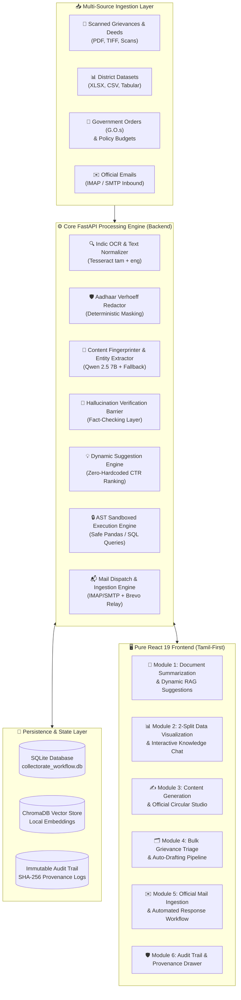

# 🏛️ Erode District Collectorate AI Administrative Assistant
## ஈரோடு மாவட்ட ஆட்சியரகம் — AI நிர்வாகப் பணிமனை
### *Production Grade v1.0 | Local-First | Zero Hallucination Architecture | Tamil-First Bilingual*

[](https://python.org)
[](https://fastapi.tiangolo.com)
[](https://react.dev)
[](https://vitejs.dev)
[](https://ollama.ai)
[](https://docs.python.org/3/library/ast.html)
[](https://pytest.org)

---

## 📋 Executive Overview

The **Erode Collectorate AI System** is an enterprise-grade, local-first artificial intelligence platform purpose-built for the **District Administration of Erode, Tamil Nadu**. 

Engineered to operate securely within air-gapped or local government infrastructure, the system automates citizen grievance processing, extracts policy allocations from complex budget documents, interrogates multi-year district datasets through natural language Tamil queries, drafts formal government communications, and orchestrates official email workflows with **zero cloud dependencies** and **zero AI hallucination**.

---

## 🏗️ System Architecture



---

## 🌟 Core Functional Modules

### 1. 📄 Module 1: Document Summarization & Dynamic Prompt Engine
- **Multi-Format Ingestion**: Ingests PDF, Excel, CSV, Indic OCR Scans, Word (`.docx`), and Plain Text.
- **AI Content Fingerprinting**: Extracts structured metadata, domain classification, department allocations, and key entities via local `qwen2.5:7b` (with deterministic fallback).
- **Dynamic Prompt Suggestion Engine**: 100% grounded, zero-hardcoded suggestions dynamically synthesized from the uploaded file's content fingerprint.
- **CTR-Based Personalization Layer**: Ranks suggestions by click-through rates and historical officer preferences.
- **Anti-Hallucination Verification Barrier**: Blocks generic hallucinated phrases and verifies numbers/dates against document fingerprint facts.
- **Multi-Type Executive Summarization**: Generates Executive Briefs, Department Allocation Tables, Policy Announcements, and Action Items with page-level citations.

---

### 2. 📊 Module 2: Data Analytics & Interactive Visualization
- **2-Split Conversational Knowledge Architecture**:
  - **Left Split (Visual Analytics)**: Shows **one prominent chart at a time** with quick switcher tabs for Bar (`பட்டை`), Line (`கோடு`), Donut/Pie (`வட்டம்`), Area (`பரப்பு`), and Scatter (`புள்ளி`) charts, followed directly by the **Graphics Data Table**.
  - **Right Split (Knowledge Conversation)**: AI Chat grounded in dataset facts with initial automated insights cards, recommended prompt chips, and voice input.
- **Natural Administrative Representation**: Replaced coordinate math jargon (`X-Axis` / `Y-Axis`) with intuitive administrative Tamil labels: **`பிரிவு (Category)`** and **`அளவு (Metric)`**.
- **High-Resolution Export**: Export crisp 2x DPI PNG visuals with white background, clean black labels, explicit X/Y titles, and Tamil header stamps. Also supports one-click CSV export.
- **AST Security Sandbox**: Parses Python AST to block dangerous system operations (`import`, `exec`, `eval`, `open`, `os`, `sys`, mutations) and executes only read-only Pandas aggregations.
- **1.5× IQR Outlier & Anomaly Inspector**: Mathematically isolates budgetary or petition anomalies with deviation factors and Tamil explanations.

---

### 3. 🗂️ Module 3: Bulk Citizen Grievance Triage Pipeline
- **Continuous Watcher Ingestion**: Watches hot folders and ingests batches of grievance petitions.
- **Dual-Language Tesseract OCR**: Tamil (`tam`) and English (`eng`) text extraction with layout preservation.
- **Deterministic Aadhaar Redaction**: Validates 12-digit Aadhaar numbers using the Verhoeff checksum algorithm and redacts them (`XXXXXXXX1234`) to comply with Indian data protection norms.
- **Automated Classification & Priority Scoring**: Classifies petitions into 12 Collectorate Departments (Revenue, DRDA, Social Welfare, ADW, BC/MBC, PWD, Police, Municipality, Health, Agriculture, Education, Civil Supplies) with SLA tracking.
- **Grounded Acknowledgement Drafting**: Generates formal Tamil acknowledgement letters formatted with official reference numbers (`{seq}/{DEPT}/{YEAR}`).

---

### 4. ✍️ Module 4: Official Content Generation & Template Studio
- **Official Government Templates**:
  - 📰 **Press Release (`செய்தி குறிப்பு`)**
  - 🔔 **Official Circular (`அலுவலக சுற்றறிக்கை`)**
  - 📋 **Office Memorandum (`அலுவலக குறிப்பாணை`)**
  - 📝 **Meeting Minutes (`கூட்ட நடவடிக்கை பதிவேடு`)**
- **Inline Rich Editing & Dual Export**: Real-time drafting with one-click export to printable `.docx` and authentic Tamil Nadu Government styled `.pdf` documents.

---

### 5. ✉️ Module 5: Official Mail Ingestion & Outbound Communication
- **Dual Inbound / Outbound Mail Architecture**:
  - **Inbound**: Listens to official IMAP / Gmail accounts (`core.kernelraise@gmail.com`), ingesting grievance emails directly into the triage workflow.
  - **Outbound**: Dispatches verified official responses via authenticated SMTP (Brevo Relay / TLS).
- **Human-in-the-Loop Safeguard**: Emails are never sent autonomously without section officer review and approval.
- **Full Provenance Logging**: Records recipient, subject, timestamp, status, and message ID in the immutable database.

---

### 6. 🛡️ Module 6: Immutable Security & Audit Trail
- **Cryptographic Provenance**: Computes SHA-256 hashes for all ingested files, generated outputs, and charts.
- **SQL & Pandas Code Provenance**: Inspectable Code Audit Drawer displaying the exact generated SQL query and Pandas execution statements.
- **Confidence Scoring Engine**: Visual SVG indicators:
  - 🟢 **High Confidence (≥ 0.85)**: Automated execution safe.
  - 🟡 **Medium Confidence (0.60 – 0.84)**: Officer review recommended.
  - 🔴 **Low Confidence (< 0.60)**: Manual intervention required.

---

## 🛠️ Technology Stack

| Layer | Technologies | Description |
| :--- | :--- | :--- |
| **Backend Framework** | Python 3.11+, FastAPI, Uvicorn, Pydantic v2 | High-concurrency asynchronous REST API |
| **Local AI Engine** | Ollama (`qwen2.5:7b`), llama.cpp | Local zero-cloud LLM with deterministic fallbacks |
| **OCR & Document Parsing** | Tesseract OCR (`tam` + `eng`), PyMuPDF, python-docx, openpyxl | Multi-format government document ingestion |
| **Data Engine & Sandboxing** | Pandas, NumPy, Python AST Sandbox, SQLite3 | Secure read-only analytical execution |
| **Vector DB & Search** | ChromaDB, Sentence-Transformers | Semantic indexing and grounded retrieval |
| **Frontend Architecture** | React 19, Vite 8.2, JavaScript (JSX), Zustand | High-performance reactive SPA |
| **Data Visualization** | Recharts 3.10, HTML5 Canvas, SVG | Interactive charts & 2x DPI high-resolution exports |
| **PDF & Document Export** | html2pdf.js, docx-templates | Official Tamil Nadu format document generation |
| **Styling & Localization** | Vanilla CSS, i18next (Tamil தமிழ் & English) | Tamil Nadu Government theme system |

---

## 📁 Repository Directory Structure

```
Erode_Collectrate/
├── backend/
│   ├── config.py                           # Central configuration & directory paths
│   ├── main.py                             # Unified CLI runner (--mode all | api | worker)
│   ├── server.py                           # FastAPI application & router registry
│   ├── modules/
│   │   ├── document_summary/               # Module 1: Document Summarization & Dynamic RAG
│   │   │   ├── extractor.py                # Multi-format text/table extraction
│   │   │   ├── fingerprinter.py            # Qwen 2.5 7B AI Content Fingerprinting
│   │   │   ├── hallucination_barrier.py    # Zero-hallucination verification
│   │   │   ├── suggestion_engine.py        # Dynamic prompt suggestions & CTR ranking
│   │   │   ├── summarizer.py               # Structured summary generator
│   │   │   └── router.py                   # Document & Suggestion REST endpoints
│   │   ├── data_viz/                       # Module 2: Data Analytics & Visualization
│   │   │   ├── chart_engine.py             # Recharts & PNG visual rendering
│   │   │   ├── ingestion.py                # Dataset ingestion & caching
│   │   │   ├── profiler.py                 # 1.5x IQR Outlier detection
│   │   │   ├── query_engine.py             # Tamil NL to AST-sandboxed Pandas execution
│   │   │   ├── sandbox.py                  # Python AST security validator
│   │   │   ├── schema_detector.py          # Auto-detection of taluks, depts, amounts
│   │   │   └── router.py                   # Data viz REST endpoints
│   │   └── mail/                           # Module 5: Mail Ingestion & Dispatch
│   │       ├── imap_worker.py              # Inbound email polling worker
│   │       ├── smtp_client.py              # Outbound dispatch engine
│   │       └── router.py                   # Mail REST endpoints
│   ├── pipeline/                           # Core Pipeline Engine
│   │   ├── database.py                     # SQLite schema, migrations & CRUD operations
│   │   ├── ocr_engine.py                   # Tesseract dual-language OCR
│   │   ├── orchestrator.py                 # File watcher & workflow coordinator
│   │   └── verhoeff.py                     # Mathematical Aadhaar validator
│   ├── routers/
│   │   ├── content.py                      # Content generation router
│   │   └── general.py                      # General assistant router
│   ├── tests/                              # Automated test suite (Pytest)
│   │   ├── test_document_summary.py        # 8 tests for Module 1
│   │   ├── test_data_viz.py                # 11 tests for Module 2
│   │   └── test_mail_engine.py             # Mail integration tests
│   └── data/
│       └── seed_datasets.py                # Seed collectorate administrative datasets
│
├── frontend/
│   ├── src/
│   │   ├── components/
│   │   │   ├── layout/                     # Sidebar, TopBar, MainContent
│   │   │   ├── modules/                    # DataModule, ContentModule, BulkModule, etc.
│   │   │   └── shared/                     # ConfidenceBadge, TnEmblem
│   │   ├── lib/
│   │   │   └── api.js                      # Central API client
│   │   ├── stores/
│   │   │   └── appStore.js                 # Zustand global application state
│   │   ├── locales/                        # Tamil (ta.json) & English (en.json)
│   │   ├── App.jsx
│   │   └── index.css                       # Tamil Nadu Government design system
│   ├── package.json
│   └── vite.config.js                      # Vite proxy & build configuration
│
├── PRESENTATION.md                         # Executive presentation deck & pitch
├── walkthrough.md                          # Technical change log & walkthrough
└── README.md                               # Project documentation
```

---

## ⚡ Quickstart & Setup Guide

### 1. Prerequisites
- **Python**: 3.11+
- **Node.js**: 18+ and `npm`
- **Tesseract OCR**: with Tamil (`tam`) and English (`eng`) language packs
- **Ollama**: (Optional for LLM acceleration; deterministic fallback active by default)
  ```bash
  ollama run qwen2.5:7b
  ```

---

### 2. Backend Setup
```bash
cd backend

# Create and activate virtual environment
python -m venv venv
# Windows:
.\venv\Scripts\activate
# Linux/macOS:
source venv/bin/activate

# Install dependencies
pip install -r requirements.txt

# Run all services (FastAPI + Background Workers)
python main.py --mode all
```
*The FastAPI backend will start at `http://127.0.0.1:8000` (API documentation at `/docs`).*

---

### 3. Frontend Setup
```bash
cd frontend

# Install Node dependencies
npm install

# Start Vite development server
npm run dev
```
*The React UI will launch at `http://localhost:5173`.*

---

### 4. Running the Test Suite
```bash
cd backend
pytest tests/test_document_summary.py tests/test_data_viz.py -v
```

---

## 🔒 Security & Privacy Guarantees

1. **100% Air-Gapped / Local-First**: No citizen data, grievance records, or government documents ever leave the local machine or district server.
2. **Deterministic Aadhaar Protection**: Validated via Verhoeff checksum algorithm and masked before database persistence.
3. **AST Execution Sandbox**: Natural language data queries are strictly constrained to mathematical aggregations, preventing remote code execution (RCE) or file modification.
4. **Officer Gating**: Outbound communications require explicit officer approval before dispatch.

---

## 📜 License & Acknowledgements

- Built for the **Erode District Administration, Government of Tamil Nadu**.
- Designed to empower district officers with modern, secure, and verifiable AI workflows.
