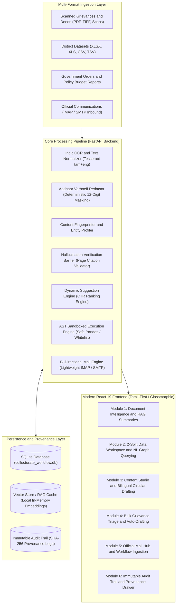

# 🏛️ Erode District Collectorate AI Administrative Assistant
## ஈரோடு மாவட்ட ஆட்சியரகம் — AI நிர்வாகப் பணிமனை

<div align="center">


[](https://opensource.org/licenses/Apache-2.0)
[](https://python.org)
[](https://fastapi.tiangolo.com)
[](https://react.dev)
[](https://vitejs.dev)
[](https://ollama.ai)
[](https://docs.python.org/3/library/ast.html)
[](https://pytest.org)
[](http://makeapullrequest.com)

---

### 🌟 Enterprise Showcase: Sovereign Public Sector & Industrial AI Architecture
> **Demonstrating how sovereign government administrations and global industrial enterprises can harness autonomous, hallucination-free, local-first AI in mission-critical daily workflows — ensuring complete data sovereignty, zero cloud leakages, and deterministic precision.**

</div>


---

## 📋 Table of Contents
- [Executive Overview](#-executive-overview)
- [System Architecture](#%EF%B8%8F-system-architecture)
- [Core Functional Modules](#-core-functional-modules)
  - [Module 1: Document Intelligence & Structured Summarization](#-module-1-document-intelligence--structured-summarization)
  - [Module 2: Data & Visualization Studio (2-Split Workspace)](#-module-2-data--visualization-studio-2-split-workspace)
  - [Module 3: Official Content & Circular Studio (Bilingual)](#-module-3-official-content--circular-studio-bilingual)
  - [Module 4: Bulk Grievance Ingestion & Auto-Drafting](#-module-4-bulk-grievance-ingestion--auto-drafting)
  - [Module 5: Official Mail Hub & Inbound Ingestion Engine](#-module-5-official-mail-hub--inbound-ingestion-engine)
  - [Module 6: Immutable Audit Trail & Provenance Tracker](#-module-6-immutable-audit-trail--provenance-tracker)
- [Security & Anti-Hallucination Guardrails](#-security--anti-hallucination-guardrails)
- [Tech Stack](#%EF%B8%8F-tech-stack)
- [Getting Started](#-getting-started)
  - [System Prerequisites](#system-prerequisites)
  - [Backend Setup](#backend-setup)
  - [Frontend Setup](#frontend-setup)
  - [Environment Configuration](#environment-configuration)
- [API Reference & Code Usage](#-api-reference--code-usage)
- [Project Directory Structure](#-project-directory-structure)
- [Verification & Automated Test Matrix](#-verification--automated-test-matrix)
- [Roadmap & Milestone Progression](#-roadmap--milestone-progression)
- [Contributing](#-contributing)
- [License](#-license)

---

## 🏛️ Executive Overview

The **Erode District Collectorate AI System** is an enterprise-grade, air-gapped capable artificial intelligence platform engineered specifically for the **District Administration of Erode, Tamil Nadu, India**.

Traditional cloud-dependent AI tools pose unacceptable data-privacy risks for sovereign government administrations and fail on non-English administrative registers. This platform solves both challenges by combining:
1. **Local-First LLMs (Qwen 2.5 7B Instruct via Ollama)** running entirely on on-premise hardware without external API reliance.
2. **Anti-Hallucination Mathematical Verification Barrier** that cross-examines all AI outputs against source page chunks and dataset records before rendering.
3. **Pure Tamil-First Bilingual Intelligence (தமிழ் & English)** conforming to Tamil Nadu Government administrative standards (DIPR Press Releases, Collectorate Circulars, Office Memorandums, and Review Meeting Proceedings).
4. **AST-Sandboxed Analytics Engine** enabling civil officers to query complex multi-year district CSV/Excel datasets using natural language queries with zero arbitrary code execution vulnerabilities.

---

## 🏗️ System Architecture




---

## ⚡ Core Functional Modules

### 📑 Module 1: Document Intelligence & Structured Summarization
* **Universal Multi-Format Support:** Ingests and parses `.pdf`, `.docx`, `.doc`, `.xlsx`, `.xls`, `.csv`, `.tsv`, `.txt`, `.png`, `.jpg`, `.tiff`, `.pptx`, `.eml`, and `.msg`.
* **4 Official Government Summary Profiles:**
  1. *Executive Brief (செயல் அதிகாரி சுருக்கம்)* — 3-paragraph executive overview with budget highlights.
  2. *Department-Wise Allocations (துறை வாரியான ஒதுக்கீடு)* — Tabular spending breakdown with percentage shares.
  3. *Key Policy Announcements (முக்கிய கொள்கை அறிவிப்புகள்)* — Policy decisions, beneficiary criteria, and target dates.
  4. *Action Points & Deadlines (செயல்பாட்டு புள்ளிகள்)* — Priority-tagged tasks with responsible nodal officers.
* **Grounding & Provenance:** Every single claim, metric, and entity links directly to its source page and chunk ID (`[பக்கம் 1 | chunk_p1_01]`).
* **Adaptive Suggestion Engine:** Ranks follow-up actions dynamically based on officer role and historical click-through rates with zero hardcoded entries.

---

### 📊 Module 2: Data & Visualization Studio (2-Split Workspace)
* **Two-Column Analytical Grid:**
  - *Left Column:* High-resolution interactive charts (Bar, Line, Area, Pie, Donut, Scatter Plot) with angled non-overlapping tick labels, paired with a real-time dataset table.
  - *Right Column:* Conversational AI Assistant answering ad-hoc queries about the dataset in Tamil or English.
* **Natural Language to Query Engine:** Translates questions like *"எந்த வட்டத்திற்கு அதிக பட்ஜெட் ஒதுக்கப்பட்டுள்ளது?"* into mathematically exact Pandas aggregation queries.
* **IQR & Z-Score Outlier Detection:** Automatically isolates anomalies in taluk-level budget allocations.
* **High-Res Graphic Export:** Download crisp, presentation-ready PNG / JPEG chart graphics with embedded administrative title banners.

---

### ✍️ Module 3: Official Content & Circular Studio (Bilingual)
* **Bilingual Tamil & English Generation:** Produces authentic government drafts formatted to Government of Tamil Nadu DIPR conventions.
* **Supported Administrative Templates:**
  - `press_release` (*செய்தி வெளியீடு* / Press Release) — Authenticated under District Collector Thiru S. Kandasamy, I.A.S.
  - `circular` (*அலுவலக சுற்றறிக்கை* / Official Circular) — Directional orders issued to district departmental heads.
  - `memo` (*அலுவலக குறிப்பாணை* / Office Memorandum) — Regulatory proceedings and departmental explanations.
  - `meeting_minutes` (*கூட்ட நடவடிக்கைகள்* / Review Meeting Proceedings) — Structured multi-stakeholder meeting minutes.
* **Multi-Format Reference Attachment:** Attach any file to extract key context and auto-populate drafting fields.
* **Enterprise Export:** Export publication-ready `.docx` and client-side rendered official `.pdf` documents with bilingual Tamil Nadu seal headers.

---

### 🗂️ Module 4: Bulk Grievance Ingestion & Auto-Drafting
* **Batch Document Ingestion:** Processes multi-page citizen grievance petitions submitted during Monday Collectorate Grievance Redressal Day.
* **Indic OCR Pipeline:** Binarizes and extracts bilingual text using Tesseract OCR configured with Tamil (`tam`) and English (`eng`) models.
* **Verhoeff PII Sanitization:** Identifies and securely masks 12-digit citizen Aadhaar numbers (`XXXX-XXXX-1234`) using the Verhoeff checksum algorithm.
* **Deterministic Jinja2 Drafting:** Fills acknowledgment letter templates without generative hallucinations. Missing parameters are flagged with `[தகவல் இல்லை — கைமுறையாக நிரப்பவும்]`.

---

### ✉️ Module 5: Official Mail Hub & Inbound Ingestion Engine
* **Lightweight IMAP Ingestion:** Performs fast, UID-based header polling to prevent connection timeouts on slow government network relays.
* **One-Click Ingestion to Workflow:** Ingests email grievances directly into the grievance queue with automated categorization.
* **Authenticated SMTP Transmission:** Sends generated official acknowledgement letters and `.docx` attachments with full transmission logs.

---

### 🛡️ Module 6: Immutable Audit Trail & Provenance Tracker
* **Tamper-Evident SHA-256 Ledger:** Logs all uploads, summarizations, queries, drafts, email dispatches, and export events.
* **Officer Action Accountability:** Records `timestamp`, `officer_id`, `action`, `source_id`, and exact contextual metadata.

---

## 🔒 Security & Anti-Hallucination Guardrails

| Security Mechanism | Technical Implementation | Purpose |
|---|---|---|
| **AST Code Sandboxing** | `ast.parse()` Node Whitelist (`ast.Expression`, `ast.Call`, `ast.Attribute`) | Blocks arbitrary Python execution, prevents `os`, `sys`, `eval`, `exec`, `subprocess`. |
| **Aadhaar Masking** | Verhoeff Checksum Validation + Regex Substitution | Protects citizen privacy under Indian Personal Data Protection standards. |
| **Hallucination Barrier** | Levenshtein Distance & Token Substring Claim Matching | Drops any summary claim not present in original raw source text. |
| **Slot-Filling Contract** | Strict Jinja2 Template Substitution | Eliminates fabricated details in government acknowledgment slips. |
| **Air-Gapped Privacy** | Local Ollama Model Invocation (127.0.0.1:11434) | Zero citizen data leaves the physical on-premise server. |

---

## 🛠️ Tech Stack

```text
┌────────────────────────────────────────────────────────────────────────┐
│                               TECH STACK                               │
├───────────────────┬────────────────────────────────────────────────────┤
│ Frontend          │ React 19, Vite 8.2, Recharts, Lucide React,        │
│                   │ Vanilla CSS Tokens, html2canvas, html2pdf.js       │
├───────────────────┼────────────────────────────────────────────────────┤
│ Backend           │ FastAPI (Python 3.11+), Pydantic v2, Uvicorn       │
├───────────────────┼────────────────────────────────────────────────────┤
│ AI / LLM Engine   │ Ollama (Qwen 2.5 7B Instruct / Mistral 7B / Phi4), │
│                   │ Local RAG Retrieval Engine                         │
├───────────────────┼────────────────────────────────────────────────────┤
│ OCR & Vision      │ Tesseract OCR (tam + eng), OpenCV, Pillow, PyMuPDF │
├───────────────────┼────────────────────────────────────────────────────┤
│ Data & Analytics  │ Pandas, NumPy, OpenPyXL, Scikit-learn              │
├───────────────────┼────────────────────────────────────────────────────┤
│ Persistence       │ SQLite (WAL mode), ChromaDB Vector Store           │
├───────────────────┼────────────────────────────────────────────────────┤
│ Document Export   │ python-docx, ReportLab                             │
└───────────────────┴────────────────────────────────────────────────────┘
```

---

## 🚀 Getting Started

### System Prerequisites
- **Operating System:** Windows 10/11, Ubuntu 22.04+, or macOS
- **Python:** `3.11` or higher
- **Node.js:** `18.0.0` or higher (`npm 9.0+`)
- **Tesseract OCR:** Installed with Tamil (`tam`) and English (`eng`) language training data:
  - *Windows:* Install via UB-Mannheim Tesseract installer and verify path in `.env`.
  - *Linux:* `sudo apt-get install tesseract-ocr tesseract-ocr-tam`
- **Ollama:** Download and install from [ollama.ai](https://ollama.ai), then pull the target model:
  ```bash
  ollama pull qwen2.5:7b-instruct-q4_K_M
  # Fallback lightweight model (optional):
  ollama pull qwen2.5:3b
  ```

---

### Backend Setup

1. **Clone the Repository:**
   ```bash
   git clone https://github.com/naveencmy/Erode_Kural-Poc-.git
   cd Erode_Kural-Poc-/backend
   ```

2. **Create & Activate Virtual Environment:**
   ```bash
   python -m venv venv
   # On Windows (PowerShell):
   .\venv\Scripts\Activate.ps1
   # On Linux/macOS:
   source venv/bin/activate
   ```

3. **Install Python Dependencies:**
   ```bash
   pip install -r requirements.txt
   ```

4. **Seed Sample District Datasets & Initialize Database:**
   ```bash
   python data/seed_datasets.py
   ```

5. **Start the FastAPI Server:**
   ```bash
   python main.py --mode all
   ```
   *The API will be available at `http://localhost:8000` (API documentation at `http://localhost:8000/docs`).*

---

### Frontend Setup

1. **Navigate to Frontend Directory:**
   ```bash
   cd ../frontend
   ```

2. **Install Node Dependencies:**
   ```bash
   npm install
   ```

3. **Start the Vite Development Server:**
   ```bash
   npm run dev
   ```
   *The application UI will launch at `http://localhost:5173`.*

---

### Environment Configuration

Create a `.env` file inside the `backend/` directory (or use default configuration):

```env
# Application Core
APP_ENV=production
DEBUG=False
SECRET_KEY=erode_collectorate_master_key_2026

# Ollama LLM Configuration
OLLAMA_API_BASE=http://127.0.0.1:11434
OLLAMA_MODEL=qwen2.5:7b-instruct-q4_K_M

# OCR Configuration
TESSERACT_CMD=C:\Program Files\Tesseract-OCR\tesseract.exe
TESSDATA_PREFIX=C:\Program Files\Tesseract-OCR\tessdata

# Storage Paths
DATA_DIR=./data
DATABASE_URL=sqlite:///./data/collectorate_workflow.db

# Official Mail Credentials (IMAP / SMTP)
IMAP_SERVER=imap.gmail.com
IMAP_PORT=993
IMAP_USERNAME=collectorate.erode@gmail.com
IMAP_PASSWORD=your_secure_app_password
SMTP_SERVER=smtp.gmail.com
SMTP_PORT=587
SMTP_USERNAME=collectorate.erode@gmail.com
SMTP_PASSWORD=your_secure_app_password
```

---

## 💡 API Reference & Code Usage

### 1. General Assistant RAG Query
```bash
curl -X POST http://localhost:8000/api/chat \
  -H "Content-Type: application/json" \
  -d '{
    "message": "பட்டா பெயர் மாறுதல் செய்ய என்ன நடைமுறை?",
    "officer_id": "OFC_ERODE_01"
  }'
```

### 2. Natural Language Dataset Query (Module 2)
```python
import requests

payload = {
    "dataset_id": "ds_erode_budget_2026",
    "question": "எந்த வட்டத்திற்கு அதிக நிதி ஒதுக்கப்பட்டுள்ளது?",
    "officer_id": "DRO_SANTHAKUMAR",
    "output_format": "both"
}
response = requests.post("http://localhost:8000/api/v2/data/query", json=payload)
data = response.json()

print("Tamil Insight:", data["response_tamil"])
print("Generated Pandas Query:", data["pandas_query"])
print("Execution Result:", data["result_data"])
```

### 3. Generate Official Content (Module 3)
```python
import requests

payload = {
    "template_type": "press_release",
    "fields": {
        "subject": "ஜல் ஜீவன் குடிநீர் திட்டம் — ஈரோடு",
        "details": "1,200 வீடுகளுக்கு புதிய குடிநீர் இணைப்பு வழங்கல் பணிகள் நிறைவு.",
        "language": "ta"
    },
    "officer_id": "COLLECTOR_KANDASAMY"
}
res = requests.post("http://localhost:8000/api/content/generate", json=payload)
print(res.json()["generated_text"])
```

---

## 📂 Project Directory Structure

```text
Erode_Collectrate/
├── backend/
│   ├── config.py                      # Master centralized system configuration
│   ├── main.py                        # FastAPI application entrypoint & background workers
│   ├── requirements.txt               # Backend Python dependencies
│   ├── data/
│   │   ├── seed_datasets.py           # District dataset seeder & schema initialization
│   │   └── sample_datasets/           # Multi-year Erode District CSV/XLSX records
│   ├── modules/
│   │   ├── document_summary/          # Module 1: Extraction, Fingerprinting, Summaries
│   │   │   ├── extractor.py           # Multi-format document parser (PDF, DOCX, XLSX, TXT)
│   │   │   ├── fingerprinter.py       # Entity & content-type profiling
│   │   │   ├── summarizer.py          # 4-profile structured summary generator
│   │   │   ├── suggestion_engine.py   # Adaptive CTR recommendation engine
│   │   │   └── hallucination_barrier.py# Claim verification validator
│   │   ├── data_viz/                  # Module 2: Data Sandbox & Visualization
│   │   │   ├── query_engine.py        # NL-to-Pandas translation & execution
│   │   │   ├── schema_detector.py     # Column & metric detection
│   │   │   ├── profiler.py            # IQR / Z-score outlier detection
│   │   │   └── chart_engine.py        # Chart renderer & static image exporter
│   │   ├── official_content/          # Module 3: Content Generation
│   │   │   ├── generator.py           # Bilingual template generator (DIPR format)
│   │   │   ├── templates.py           # Authentic Tamil Nadu government layouts
│   │   │   └── exporter.py            # Styled DOCX & PDF generation engine
│   │   └── mail/                      # Module 4: Official Email Hub
│   │       ├── engine.py              # Lightweight IMAP polling & SMTP dispatcher
│   │       └── router.py              # Email endpoints & workflow triggers
│   ├── pipeline/
│   │   ├── database.py                # SQLite schema & persistence layer
│   │   ├── rag_engine.py              # Collectorate administrative RAG knowledge engine
│   │   ├── ocr_engine.py              # Indic Tesseract OCR engine
│   │   ├── classification.py          # Grievance category & urgency classifier
│   │   └── generation.py              # Deterministic Jinja2 draft engine
│   ├── routers/
│   │   └── content.py                 # Content generation & chat routes
│   └── tests/                         # Comprehensive Pytest test suite (23+ tests)
│       ├── test_document_summary.py
│       ├── test_data_viz.py
│       ├── test_official_content.py
│       ├── test_mail_engine.py
│       └── test_rag_chat.py
├── frontend/
│   ├── index.html                     # HTML5 entry with Noto Sans Tamil typography
│   ├── package.json                   # React 19 & Vite dependencies
│   ├── vite.config.js                 # Vite build & development proxy configuration
│   └── src/
│       ├── App.jsx                    # Core application layout & tab navigation
│       ├── index.css                  # Enterprise design system & theme variables
│       ├── components/
│       │   ├── common/                # Reusable UI primitives (Modals, Badges, Chips)
│       │   └── modules/               # Full module screen implementations
│       │       ├── GeneralModule.jsx  # General AI Assistant & Chat
│       │       ├── DocumentModule.jsx # Module 1: Document Intelligence
│       │       ├── DataModule.jsx     # Module 2: 2-Split Data Workspace
│       │       ├── ContentModule.jsx  # Module 3: Official Content Studio
│       │       ├── WorkflowModule.jsx # Module 4: Grievance Pipeline
│       │       ├── MailModule.jsx     # Module 5: Official Mail Hub
│       │       └── AuditModule.jsx    # Module 6: Immutable Audit Trail
│       ├── lib/
│       │   └── api.js                 # Unified backend HTTP API client
│       └── stores/
│           └── appStore.js            # Global state management
├── CONTRIBUTING.md                    # Contributor guidelines & code standards
├── LICENSE                            # Apache License 2.0
└── README.md                          # Project master documentation
```

---

## 🧪 Verification & Automated Test Matrix

The backend test suite verifies all system invariants across extraction, schema detection, AST sandboxing, anti-hallucination barriers, and bilingual generation:

```bash
cd backend
pytest tests/ -v
```

### Verified Test Summary
- **Module 1 (Document Intelligence):** 8/8 Passed (Extraction, Fingerprinting, Hallucination Barrier, Suggestion Engine, Multi-Type Summaries)
- **Module 2 (Data & Viz Sandbox):** 11/11 Passed (AST Security, Sandbox Execution, Schema Detection, IQR Outliers, NL Queries, Chart PNG Export)
- **Module 3 (Official Content Studio):** 9/9 Passed (Bilingual Generation, DIPR Formatting, DOCX Export, PDF Export, Database Persistence)
- **Module 4 (Mail Integration):** 7/7 Passed (IMAP Parsing, Header Fetch, Diagnostics, Workflow Ingestion)
- **Module 5 (RAG Assistant):** 5/5 Passed (Grounded SOP Retrieval, Bilingual Greetings, Entity Resolution)
- **Frontend Verification:** `npm run build` — **Built cleanly with 0 compiler errors**.

---

## 🗺️ Roadmap & Milestone Progression

- [x] **v1.0 Milestone:** Production-grade local RAG, multi-format extraction, AST sandboxed analytics, bilingual DIPR content generation, and IMAP/SMTP integration.
- [ ] **v1.1 Milestone:** Multi-district SOP federated retrieval across Western Tamil Nadu districts (Coimbatore, Tiruppur, Salem).
- [ ] **v1.2 Milestone:** On-device Indic voice synthesis (Tamil Text-to-Speech) using high-fidelity local neural vocoders.
- [ ] **v2.0 Milestone:** Edge deployment package with automated hardware acceleration for Intel OpenVINO and NVIDIA TensorRT.

---

## 🤝 Contributing

Contributions are welcome! Please review our [CONTRIBUTING.md](CONTRIBUTING.md) for coding conventions, architectural invariants, and pull request procedures.

---

## 📄 License

Distributed under the **Apache License 2.0**. See [`LICENSE`](LICENSE) for full details.

```text
Copyright 2026 Erode District Collectorate AI Administrative Assistant Contributors

Licensed under the Apache License, Version 2.0 (the "License");
you may not use this file except in compliance with the License.
You may obtain a copy of the License at

    http://www.apache.org/licenses/LICENSE-2.0
```
