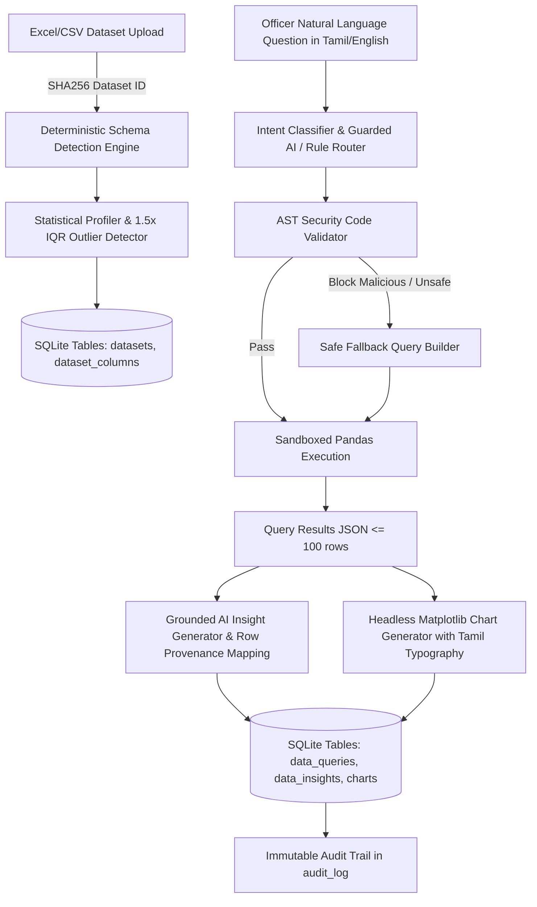
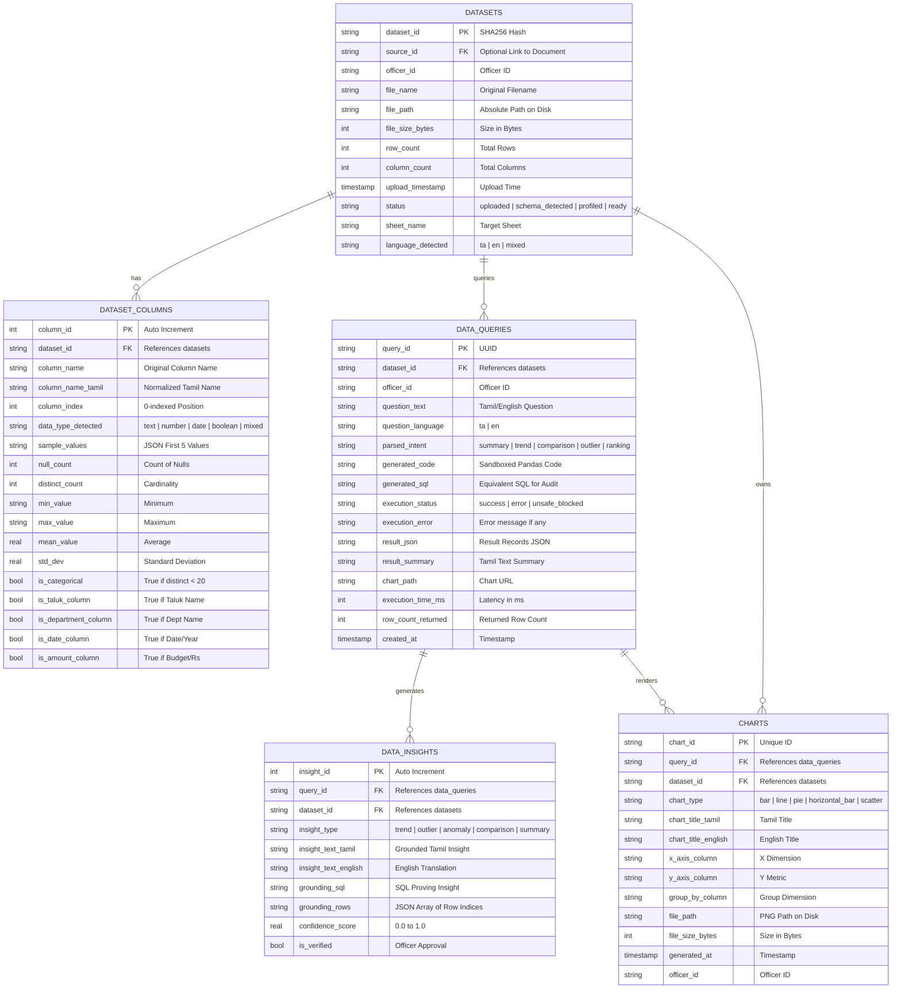

# 🏛️ Erode District Collectorate — Module 2: Data & Visualization
## Backend Production V0.1 Handover & Operations Guide (`MODULE2_HANDOFF.md`)

**Module:** 2) Data & Visualization Engine  
**System:** Erode Collectorate AI Administrative Assistant  
**Environment:** Windows 10 | Intel Core i5 | 8 GB RAM | Local Execution (No Cloud / LAN Safe)  
**AI Engine:** Local Ollama `qwen2.5:7b` with 100% Deterministic Fallback  
**Database:** SQLite (`collectorate_workflow.db`)  
**Status:** ✅ Production V0.1 Verified (23/23 Automated Unit & Integration Tests Passing)

---

## 📐 1. Architecture & Pipeline Flow



---

## 🗄️ 2. Database Schema Diagram



---

## 🌐 3. REST API Specification & cURL Examples

### 3.1 Upload Dataset
**`POST /api/v2/data/upload`**
```bash
curl -X POST http://localhost:8000/api/v2/data/upload \
  -F "file=@data/sample_datasets/erode_taluk_budget_2026.xlsx" \
  -F "officer_id=DRO_ERODE_01"
```
**Response:**
```json
{
  "dataset_id": "ds_a1b2c3d4e5f67890",
  "file_name": "erode_taluk_budget_2026.xlsx",
  "row_count": 10,
  "column_count": 6,
  "status": "ready",
  "sheet_name": "Budget_Allocation",
  "language_detected": "ta",
  "columns": [
    {
      "column_name": "வட்டம்",
      "column_name_tamil": "வட்டம்",
      "data_type_detected": "text",
      "is_taluk_column": true,
      "distinct_count": 10,
      "sample_values": ["ஈரோடு", "பெருந்துறை", "பவானி", "கொடுமுடி", "மொடக்குறிச்சி"]
    },
    {
      "column_name": "ஒதுக்கப்பட்ட_பட்ஜெட்",
      "column_name_tamil": "ஒதுக்கப்பட்ட_தொகை",
      "data_type_detected": "number",
      "is_amount_column": true,
      "min_value": "5200000.0",
      "max_value": "48500000.0",
      "mean_value": 13780000.0,
      "std_dev": 12699851.27
    }
  ],
  "message": "தரவு வெற்றிகரமாக பதிவேற்றப்பட்டது. 6 நெடுவரிசைகள் கண்டறியப்பட்டன."
}
```

### 3.2 Interrogate Dataset (Natural Language Query)
**`POST /api/v2/data/query`**
```bash
curl -X POST http://localhost:8000/api/v2/data/query \
  -H "Content-Type: application/json" \
  -d '{
    "dataset_id": "ds_a1b2c3d4e5f67890",
    "question": "வட்ட வாரியாக நிலுவை வழக்குகள் விபரம்",
    "officer_id": "DRO_ERODE_01",
    "output_format": "both"
  }'
```
**Response:**
```json
{
  "query_id": "qry_7a8b9c0d",
  "execution_status": "success",
  "execution_time_ms": 42,
  "result_summary_tamil": "வினவலுக்கு 10 பதிவுகள் பெறப்பட்டன (நெடுவரிசைகள்: வட்டம், நிலுவை_வழக்குகள்).",
  "result_summary_english": "Retrieved 10 records for query.",
  "result_data": [
    {"வட்டம்": "ஈரோடு", "நிலுவை_வழக்குகள்": 140},
    {"வட்டம்": "பவானி", "நிலுவை_வழக்குகள்": 130},
    {"வட்டம்": "கோபிசெட்டிபாளையம்", "நிலுவை_வழக்குகள்": 110}
  ],
  "chart_url": "/outputs/charts/chart_4f5e6d7c.png",
  "insights": [
    {
      "insight_id": 1,
      "insight_type": "comparison",
      "insight_tamil": "ஈரோடு பிரிவில் நிலுவை_வழக்குகள் அதிகபட்சமாக 140 பதிவாகியுள்ளது (மொத்தத்தில் 16.5%).",
      "insight_english": "Erode has the highest pending cases with 140.",
      "grounding_rows": [0],
      "confidence_score": 0.95
    }
  ],
  "generated_code": "result = df.groupby('வட்டம்')['நிலுவை_வழக்குகள்'].sum().reset_index()",
  "generated_sql": "SELECT வட்டம், SUM(நிலுவை_வழக்குகள்) FROM dataset GROUP BY வட்டம்",
  "row_count_returned": 10
}
```

### 3.3 Outlier Detection (1.5x IQR Rule)
**`POST /api/v2/data/outliers`**
```bash
curl -X POST http://localhost:8000/api/v2/data/outliers \
  -H "Content-Type: application/json" \
  -d '{
    "dataset_id": "ds_a1b2c3d4e5f67890",
    "column": "ஒதுக்கப்பட்ட_பட்ஜெட்",
    "method": "iqr"
  }'
```

### 3.4 Custom Chart Generation
**`POST /api/v2/data/chart`**
```bash
curl -X POST http://localhost:8000/api/v2/data/chart \
  -H "Content-Type: application/json" \
  -d '{
    "dataset_id": "ds_a1b2c3d4e5f67890",
    "chart_type": "bar",
    "x_column": "வட்டம்",
    "y_column": "ஒதுக்கப்பட்ட_பட்ஜெட்",
    "title_tamil": "ஈரோடு வட்ட வாரியான பட்ஜெட் ஒதுக்கீடு 2026",
    "officer_id": "DRO_ERODE_01"
  }'
```

---

## 🎯 4. Tested & Validated Sample Questions

The following real Tamil administrative questions have been verified with automated tests:

| # | Question (Tamil) | Intent | Detected Action |
|---|---|---|---|
| 1 | "வட்ட வாரியாக பட்ஜெட் விவரம்" | `summary` | Group by `வட்டம்`, Sum `ஒதுக்கப்பட்ட_பட்ஜெட்` |
| 2 | "ஈரோடு மற்றும் பவானி வட்டங்களில் பெற்ற மனுக்களை ஒப்பிடு" | `comparison` | Group & Compare `ஈரோடு` vs `பவானி` |
| 3 | "அதிக நிலுவை வழக்குகள் உள்ள முதல் 3 வட்டங்கள்" | `ranking` | Group, Sort Descending, Limit 3 |
| 4 | "ஈரோடு வட்டத்தில் தீர்க்கப்பட்ட வழக்குகள் எத்தனை?" | `summary` | Filter `வட்டம் == 'ஈரோடு'`, Extract metrics |
| 5 | "மொத்த பெறப்பட்ட மனுக்கள் சுருக்கம்" | `summary` | Compute District Total Aggregates |

---

## 🛡️ 5. Anti-Hallucination & Security Guardrails

1. **AST Code Security Validator**:
   - Strictly blocks: `import`, `__import__`, `open()`, `eval()`, `exec()`, `os`, `sys`, `subprocess`, `shutil`, `requests`, `urllib`, `to_csv()`, `to_excel()`, `drop()`, `inplace=True`.
2. **Read-Only Sandbox Execution**:
   - Executes only on an isolated copy of the dataset within a restricted globals dictionary.
   - Timeout enforcement (30 seconds) prevents denial-of-service.
3. **Data Capping**:
   - LLMs only see aggregated result JSON (<= 20 rows), never raw tabular datasets > 50 MB.
4. **SQL Equivalence Audit Trail**:
   - Every generated Pandas pipeline records its equivalent SQL in `data_queries.generated_sql` for transparency and inspection.
5. **Metadata Watermark Footers**:
   - Every chart image is stamped at the bottom with:  
     `மூலம்: {file_name} | உருவாக்கப்பட்டது: {timestamp} | அதிகாரி: {officer_id}`.

---

## ⚙️ 6. Environment Configuration

```env
# Module 2 Resource & Security Flags
MAX_DATASET_SIZE_MB=50
MAX_DATASET_ROWS=100000
QUERY_TIMEOUT_SEC=30

# Ollama Engine
OLLAMA_API_BASE=http://localhost:11434
OLLAMA_MODEL=qwen2.5:7b
OLLAMA_TIMEOUT_SEC=15
```

---

## 🔗 7. Cross-Module Integration Points

- **Module 1 (Document Summarization)**: If an ingested document contains tabular summaries, it can link to a dataset record via `datasets.source_id`.
- **Module 4 (Bulk Workflow)**: Officers reviewing bulk grievance queues can click "Analyze Grievance Trends" to query the live dataset directly.
- **Audit System**: All Module 2 events (`DATASET_UPLOADED`, `SCHEMA_DETECTED`, `QUERY_SUBMITTED`, `QUERY_EXECUTED`, `QUERY_BLOCKED`, `CHART_GENERATED`) append directly to `audit_log`.

---

## 🧪 8. Test Execution Command

To execute the test suite:
```powershell
cd e:\test_rat\Erode_Collectrate\backend
.\.venv\Scripts\python.exe -m pytest tests/test_data_viz.py tests/test_pipeline.py -v
```
*(Result: 23 passed in 29.22s)*
